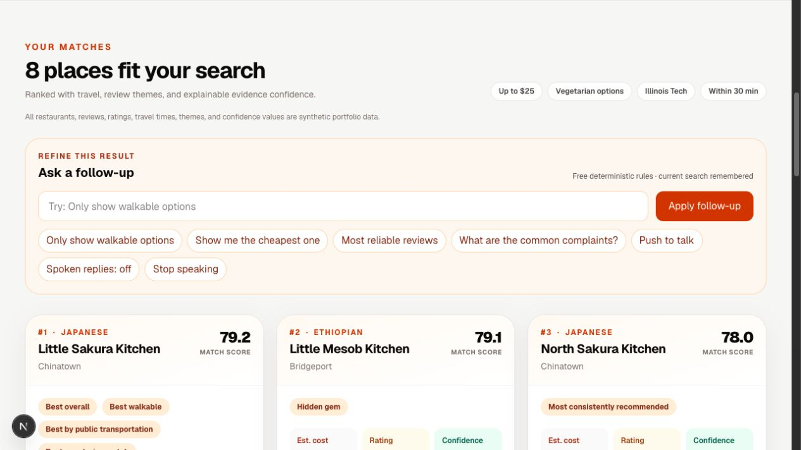

# BiteCheck

BiteCheck is an explainable restaurant recommendation app built with a typed
FastAPI backend, a Next.js interface, and a reproducible synthetic-data
pipeline. It ranks fictional Chicago restaurants by budget, dietary needs,
travel time, review themes, and evidence confidence—then shows why each result
ranked where it did.



> All restaurants, reviews, ratings, addresses, travel times, and evaluation
> labels are synthetic. The project demonstrates engineering and analytics
> methods; it does not make claims about real businesses.

## What it demonstrates

- Reproducible Python pipelines that generate and transform 24 restaurant and
  288 review records into versioned analytics artifacts
- Explainable ranking with configurable weights and per-factor score
  contributions
- Review-theme extraction with a measured synthetic baseline of 0.9825 F1
- A transparent Review Confidence model with seven supporting components and
  four penalties
- Typed FastAPI endpoints, Pydantic validation, repository/service separation,
  and safe failure states
- A responsive Next.js and TypeScript interface with deterministic follow-up
  searches and optional browser voice controls
- Automated CI for linting, strict type checks, tests, production builds, and
  dependency auditing

## Project snapshot

| Area | Result |
| --- | --- |
| Synthetic data | 24 restaurants, 288 reviews, 15 review themes |
| Automated tests | 159 total: 142 Python and 17 TypeScript |
| Quality gates | Ruff, strict mypy, ESLint, production build, npm audit |
| External services | None required; no API keys or paid providers |
| Current state | Showcase-ready MVP with local and container run paths |

Detailed measurements and their limitations are recorded in
[docs/resume-metrics.md](docs/resume-metrics.md).

## Architecture

```text
Synthetic generators -> validated JSON -> analytics transformations
                                         |
Browser -> Next.js server routes -> FastAPI services -> ranked explanations
```

The browser talks only to same-origin Next.js routes. Next.js reads the
server-only `API_BASE_URL` and forwards requests to FastAPI, so backend
configuration is never shipped to the browser.

## Run locally

Requirements: Python 3.11+ and the Node version listed in `.node-version`.

```bash
# Terminal 1 — backend
cd apps/api
python3 -m venv .venv
.venv/bin/python -m pip install '.[dev]'
.venv/bin/uvicorn --app-dir src bitecheck_api.main:app --reload

# Terminal 2 — frontend
cd apps/web
npm ci
npm run dev
```

Open `http://localhost:3000`. Interactive API documentation is available at
`http://localhost:8000/docs`. The committed demo data is ready to use; no API
key or `.env` file is needed for the default local setup.

## Verify

```bash
# From the project root
apps/api/.venv/bin/ruff check .
apps/api/.venv/bin/mypy scripts apps/api/src apps/api/tests tests
apps/api/.venv/bin/pytest

cd apps/web
npm test
npm run lint
npm run build
npm audit --omit=dev --audit-level=high
```

GitHub Actions runs the same checks on every push and pull request.

## Regenerate the analytics data

Run from the project root:

```bash
apps/api/.venv/bin/python scripts/generate_demo_data.py
apps/api/.venv/bin/python scripts/generate_review_data.py
apps/api/.venv/bin/python scripts/analyze_review_themes.py
apps/api/.venv/bin/python scripts/calculate_review_confidence.py
apps/api/.venv/bin/python scripts/build_recommendation_insights.py
```

Fixed seeds and reference dates make the artifacts reproducible. The pipeline,
schemas, assumptions, and limitations are documented in
[docs/data-pipeline.md](docs/data-pipeline.md),
[docs/data-dictionary.md](docs/data-dictionary.md), and
[docs/privacy-and-ethics.md](docs/privacy-and-ethics.md).

## Deployment

The repository includes a two-service Render Blueprint, a production backend
`Dockerfile`, and standard Next.js production commands. Both services can be
created together on Render's free plan:

[](https://render.com/deploy?repo=https%3A%2F%2Fgithub.com%2FAkashC007%2Fbitecheck)

See [docs/deployment.md](docs/deployment.md) for the service connection,
environment variables, free-tier behavior, and public smoke checks.

## More documentation

- [Architecture](docs/architecture.md)
- [Ranking methodology](docs/ranking-methodology.md)
- [Review Confidence methodology](docs/review-confidence-methodology.md)
- [Conversation methodology](docs/conversation-methodology.md)
- [Project decisions](docs/project-decisions.md)
